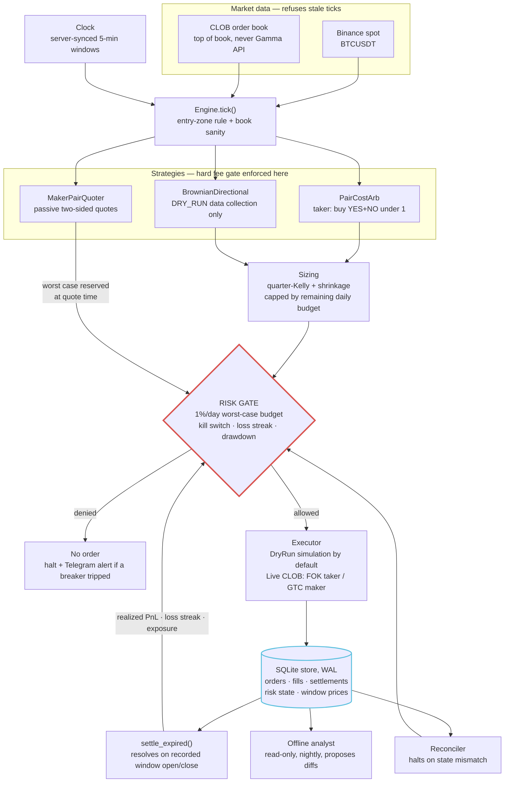

# Architecture — BTC 5-minute educational engine

This document describes the **actual** tick path in this repository. It
does not invent services. It is the architecture of one specialized
Polymarket BTC 5-minute research engine, not a generic bot framework.

**No LLM in the execution path.** Offline review lives in
[analyst-prompt.md](analyst-prompt.md).

```
Polymarket BTC 5-minute engine
        ↓
pair arbitrage
        +
maker experiments
        +
directional experiments
        +
paper / DRY_RUN research
```

## Why this architecture exists

The original design problem is a 5-minute binary that settles on a BTC
spot move. That problem punishes three classes of engineering mistake:

1. **Stale or fictional prices.** The Gamma API on these markets has
   returned a 0.5 default. Feeds therefore read the **CLOB order book**
   and refuse stale ticks.
2. **Unbounded daily loss.** Every order carries a worst-case loss into
   a single risk gate. Restarting the process cannot reset the budget.
3. **A pair that is not a pair.** Buying only one side of YES+NO is
   directional exposure. Legs are sized to equal shares; a failed second
   leg **halts**.

The resulting shape is a straight pipeline. Strategies propose; the risk
gate decides; the executor is the last step, not the first.

## Repository flow

```
Market data
    ↓
Feeds
    ↓
Engine
    ↓
Strategies
    ↓
Risk gate
    ↓
Executor
    ↓
Store
```

Expanded:

```
Binance spot (BTCUSDT REST)     CLOB top-of-book REST
              \                       /
               \                     /
            Clock (server-synced 5-min windows)
                         ↓
              Engine.tick() + settle_expired()
                         ↓
     PairCostArb    MakerPairQuoter    BrownianDirectional
                         ↓
              Sizing (quarter-Kelly, budget cap)
                         ↓
         Risk gate (deny by default; halt needs human reset)
                         ↓
         DryRunExecutor  (default)  |  LiveClobExecutor (gated)
                         ↓
              SQLite store (WAL)
                         ↓
         settle_expired()  →  risk gate (realized PnL, streak)
         Reconciler        →  skip in DRY_RUN; live unimplemented
```

## Tick path

Every order takes the same path. The risk gate is the only door to the
executor.



Risk-gate state lives in the store, not only in memory: a restart
rebuilds daily PnL, loss streak, open exposure, and halt status before
the first tick.

`bot.py` discovers the current window (`discover_current_market`) via
CLOB metadata (`fetch_market_window` in `src/feeds.py`), then polls
spot + both books and calls `Engine.tick()`. Settlement runs every loop
iteration even when no market is tradeable, so accounting does not
starve.

## Module map

Only files that exist:

| Module | Responsibility |
|---|---|
| `src/config.py` | Pydantic v2 settings; `DRY_RUN` default; live-mode ack gate; full Kelly forbidden; daily loss % hard-capped at 5% |
| `src/timeutil.py` | Server-synced clock, 5-min window alignment, entry-zone rule (no entries under `ENTRY_MIN_REMAINING_S`, default 20s to close) |
| `src/feeds.py` | Binance spot + CLOB top-of-book; `is_stale()`; never Gamma API |
| `src/fees.py` | CLOB fee model `rate * min(p, 1-p)`; **hard** fee gate; tick rounding (down) |
| `src/models.py` | Market window, book, order, fill, signal types |
| `strategies/strategy.py` | `PairCostArb` and `BrownianDirectional` + `EwmaVol` |
| `strategies/maker.py` | `MakerPairQuoter`: two-sided pair quotes with reprice → taker-hedge → hold-with-alert |
| `src/sizing.py` | Quarter-Kelly with probability shrinkage toward 0.5, min/max/bankroll-fraction caps, floor rounding |
| `src/risk_gate.py` | Worst-case daily budget + kill-switch, daily loss, loss streak, drawdown, open exposure. Deny by default |
| `src/engine.py` | Tick orchestration, equal-shares pair execution, unhedged-leg halt, settlement, risk-state restore |
| `src/executor.py` | `DryRunExecutor` (pessimistic fills) / `LiveClobExecutor` (lazy import; FOK taker / GTC maker) |
| `src/store.py` | SQLite (WAL): orders (idempotent client ids), fills, settlements, window prices, persisted risk state |
| `src/reconciler.py` | Startup + periodic local-vs-exchange check. **Live path raises `NotImplementedError`** |
| `src/calibration.py` | Rolling Brier / log loss / hit rate for directional records |
| `src/notifier.py` | Optional Telegram alerts with secret redaction (alerts only) |
| `bot.py` | CLI: `run` / `status` / `reset` / `approve` (approve is a stub) |

Strategy identifiers (`pair_cost_arb`, `brownian_dir`, `pair_cost_maker`)
are unchanged. Only file locations moved during repository organization.

### What is not in this tree

Do not assume these exist: a web dashboard, a websocket production feed
(comments mention WS as a future swap with the same interface), a live
position API client, allowance-approval transactions, a lockfile, or a
deploy pipeline. Quality CI is read-only.

The "offline analyst" in the diagram is a **prompt**
([analyst-prompt.md](analyst-prompt.md)), not a running service.

## Capital-protection invariants (engineering lessons)

These are the original engine rules. They teach defensive design. They
do not make paper or live results reliable.

1. **1%-per-day worst case.** Every order carries its worst-case loss to
   the risk gate. Realized daily loss + worst-case of open positions +
   the new order must fit in
   `min(MAX_DAILY_LOSS, bankroll * MAX_DAILY_LOSS_PCT)`.
2. **Restart-proof limits.** Daily PnL, loss streak, open exposure, halt
   state, and the equity high-water mark are rebuilt from SQLite at
   startup. `python bot.py reset` is the only clear, and it asks for
   confirmation.
3. **Pairs are pairs.** Both arb legs use the same share count (bounded
   by the thinner ask). If the second leg fails after the first fills,
   the engine marks `unhedged`, **halts**, and alerts.
4. **Settlement runs every loop.** `settle_expired()` resolves filled
   orders against recorded window open/close prices so breakers can
   trip. Losing legs of a completed pair do not count toward the loss
   streak.
5. **Drawdown breaker.** Equity dropping `MAX_DRAWDOWN_PCT` (default 5%)
   below its high-water mark halts the engine for human review.
6. **Optional daily lock.** `DAILY_PROFIT_LOCK_PCT` can deny new orders
   for the rest of the UTC day once a realized target is hit (off by
   default). This is a stop-trading switch, not a performance claim.
7. **Directional guards.** No directional entries until EWMA vol has
   `VOL_MIN_SAMPLES` observations, `DIR_MIN_ELAPSED_S` of the window has
   elapsed, and the book spread is within `MAX_SPREAD`. Size is capped
   by displayed liquidity. Live directional remains disabled
   (`enable_directional_live = False`).
8. **Live bankroll sync (gated path).** In live mode the engine would
   size off `min(configured bankroll, wallet balance)`. Live mode is
   not the supported lab mode.
9. **Maker quotes do not rest unattended.** Naked-leg worst case is
   reserved at quote time. One-sided fills escalate reprice → taker
   hedge → hold-to-settlement with alert. Unfilled quotes are cancelled
   at `QUOTE_CANCEL_REMAINING_S`, on halt (`go_flat`), and on restart.

## Engineering lessons (from the source, not invented)

| Lesson | Where it shows up |
|---|---|
| Do not price these markets from Gamma | `src/feeds.py` — CLOB book only |
| Fees are a hard gate, not a log line | `src/fees.py` + strategy `evaluate()` |
| A failed second pair leg is an incident | `src/engine.py` `_execute_pair` |
| Paper fills are not live fills | `src/executor.py` `DryRunExecutor` |
| Reconciliation is a launch blocker, not a nice-to-have | `src/reconciler.py` |
| The model stays off the hot path | no LLM import in `src/` or `strategies/` |

## Related documents

- [Getting started](getting-started.md)
- [Paper / DRY_RUN](paper-trading.md)
- [Strategies](strategies.md)
- [Limitations](limitations.md)
- [Security notes](../SECURITY.md)
- [Pre-PolyTutor audit](../SECURITY_AUDIT.md)
