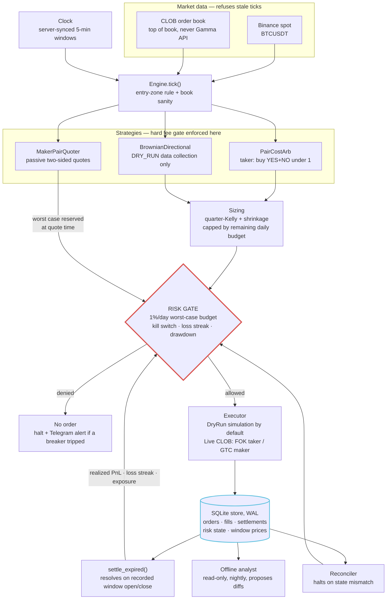

# Architecture — BTC 5-minute engine

Deterministic trading engine for Polymarket BTC 5-minute markets.
**No LLM in the execution path.** The agent's job (Hermes / Claude Code) is to
build, audit, and tune this code offline — see [analyst-prompt.md](analyst-prompt.md).

Design goal: **capital preservation first**. The engine is built so that no
single UTC day can lose more than `MAX_DAILY_LOSS_PCT` of the bankroll
(default **1%**), even counting open positions at their worst case, even
across process restarts.

This is a research lab around one specialized engine, not a generic bot
framework.

```
Polymarket BTC 5-minute engine
        ↓
pair arbitrage
        +
maker experiments
        +
directional experiments
        +
paper / DRY_RUN research
```

## Tick path

Every order takes the same path, and the risk gate is the only door to the
executor. Nothing reaches the exchange without passing the daily budget check.



Risk-gate state lives in the store, not in memory: a restart rebuilds the
daily PnL, loss streak, open exposure and halt status before the first tick.

## Module map

| Module | Responsibility |
|---|---|
| `src/config.py` | Pydantic v2 settings; DRY_RUN default; live-mode ack gate; full Kelly forbidden; daily loss % hard-capped at 5% |
| `src/timeutil.py` | Server-synced clock, 5-min window alignment, entry-zone rule (no entries < 20s to close) |
| `src/fees.py` | CLOB fee model `rate * min(p, 1-p)`; **hard** fee gate; tick rounding (down) |
| `strategies/strategy.py` | `PairCostArb` (bounded downside — go live with this first) and `BrownianDirectional` (DRY_RUN data collection only) + EWMA vol with warm-up counter |
| `strategies/maker.py` | `MakerPairQuoter`: passive two-sided pair quotes (sum ≤ 1 − MIN_EDGE) with reprice → taker-hedge → hold-with-alert escalation on one-sided fills |
| `src/sizing.py` | Quarter-Kelly with probability shrinkage toward 0.5, min/max/bankroll-fraction caps, floor rounding |
| `src/risk_gate.py` | Worst-case daily budget (the 1% rule) + circuit breakers: kill-switch file, daily loss, loss streak, drawdown from high-water mark, open exposure. Deny by default; halts need human reset |
| `src/engine.py` | Tick orchestration, equal-shares pair execution with unhedged-leg halt, settlement loop, risk-state persistence/restore |
| `src/executor.py` | DryRun simulator (pessimistic fills) / Live CLOB adapter (FOK orders, Safe `signature_type=2` paired with `funder`) |
| `src/store.py` | SQLite (WAL): orders (idempotent client IDs), fills, settlements, window open/close prices, persisted risk state |
| `src/reconciler.py` | Startup + periodic state-vs-exchange check; mismatch = halt |
| `src/calibration.py` | Rolling Brier / log loss / hit rate |
| `src/notifier.py` | Telegram alerts with secret redaction (alerts only — control belongs to the external supervisor bot) |
| `src/feeds.py` | Binance spot + CLOB top-of-book; refuses stale ticks; never Gamma API |
| `src/models.py` | Market window, book, order, fill, signal types |
| `bot.py` | CLI entrypoint (`run` / `status` / `reset` / `approve`) |

Strategy names (`pair_cost_arb`, `brownian_dir`, maker strategy id) are
unchanged. Only file locations moved.

## Capital-protection invariants

1. **1%-per-day worst case.** Every order carries its worst-case loss to the
   risk gate. Realized daily loss + worst-case of open positions + the new
   order must fit in `min(MAX_DAILY_LOSS, bankroll * MAX_DAILY_LOSS_PCT)`.
   Directional sizes are trimmed to the *remaining* budget, so the engine
   uses the budget efficiently but can never overshoot it.
2. **Restart-proof.** Daily PnL, loss streak, open exposure/risk, halt state
   and the equity high-water mark are rebuilt from SQLite at startup.
   Restarting the process cannot reset a limit or clear a halt
   (`python bot.py reset` is the only way, and it asks for confirmation).
3. **Pairs are pairs.** Both arb legs are sized to the SAME share count
   (bounded by the thinner ask). If the second leg fails after the first
   fills, the engine marks the position `unhedged`, **halts**, and alerts —
   a naked binary near settlement is not something to retry programmatically.
4. **Settlement actually happens.** `settle_expired()` runs every loop
   iteration, resolving filled orders against recorded window open/close
   prices, so the daily-loss and streak breakers trip when they should.
   Losing legs of a profitable pair never count toward the loss streak.
5. **Drawdown breaker.** Equity dropping `MAX_DRAWDOWN_PCT` (default 5%)
   below its high-water mark halts the engine for human review.
6. **Optional profit lock.** `DAILY_PROFIT_LOCK_PCT` stops trading for the
   rest of the day once the target is hit (off by default).
7. **Directional guards.** No directional entries until the EWMA vol has
   `VOL_MIN_SAMPLES` observations, `DIR_MIN_ELAPSED_S` of the window has
   elapsed, and the book spread is within `MAX_SPREAD`. Size is also capped
   by displayed liquidity, so FOK orders aren't submitted into thin books.
8. **Live bankroll sync.** In live mode the engine sizes off
   `min(configured bankroll, actual wallet balance)`.
9. **Maker quotes can never rest unattended.** The naked-leg worst case is
   reserved against the daily budget at *quote* time (before anything can
   fill); on a one-sided fill the quoter escalates reprice → taker hedge
   (bounded by `HEDGE_MAX_LOSS_PER_SHARE`) → hold-to-settlement with alert;
   all unfilled quotes are torn down at `QUOTE_CANCEL_REMAINING_S` before
   close, on any halt (`go_flat`), and on restart (stale `open` orders are
   cancelled locally, plus `cancel_all` on-exchange in live mode).
